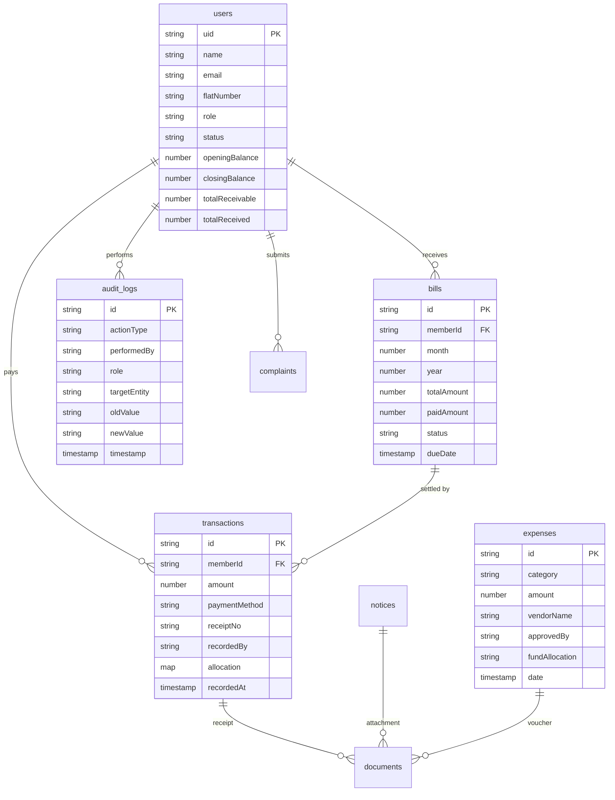

# 🧠 Society Audit Log — Complete System Deep-Dive Analysis

> **Project**: Society Audit Log
> **Domain**: Civic Tech / Housing Society Management
> **Platforms**: Flutter Mobile (Android/iOS) + Next.js Web Dashboard
> **Backend**: Firebase (Firestore + Auth + Storage)
> **Status**: MVP — deployed for Shivkrupasagar CHS Ltd.

---

## 🔷 PART 1 — PRODUCT DEEP DIVE

### 1.1 Problem Analysis (Real-World + Operational)

Indian cooperative housing societies (CHS) — typically 20–100 flats — operate under the Maharashtra Cooperative Societies Act, 1960. They are **legally required** to maintain auditable financial records, conduct Annual General Meetings (AGMs), and submit audited balance sheets to the Registrar of Cooperative Societies.

**The reality on the ground:**

| Problem | How It Manifests |
|---|---|
| **Paper-first record keeping** | Handwritten registers for maintenance collection, stored in a committee member's flat. Lost during monsoons, misplaced during handovers. |
| **Excel-driven accounting** | A treasurer maintains a `.xlsx` file on their personal laptop. No version control. The file is freely editable — any cell can be changed retroactively. |
| **WhatsApp as infrastructure** | Payment confirmations sent as screenshots. Notices posted in group chats. No searchability, no structure. Messages lost in scroll history. |
| **Trust deficit** | Outgoing committees accused of data manipulation. Incoming committees start from scratch because they don't trust inherited records. |
| **Audit panic** | Societies scramble to reconstruct records weeks before statutory audits. Receipts are fabricated, numbers are reverse-engineered from bank statements. |
| **Elder exclusion** | Committee members are often 55–70 years old. Complex software overwhelms them. They revert to paper. |

### 1.2 Why Current Solutions Fail

| Existing Solution | Why It Fails |
|---|---|
| **Tally / QuickBooks** | Designed for businesses, not societies. No concept of flats, wings, maintenance demands, or fund allocation (sinking fund, repair fund). Steep learning curve. |
| **MyGate / NoBroker Society** | Focused on visitor management and amenity booking. Financial modules are shallow — cannot handle the complexity of Indian CHS accounting (NOC charges, municipal tax pass-through, delay penalties). |
| **ApnaComplex / JEEV** | Better fit but expensive (₹3–8/flat/month), require internet constantly, and lock data behind their servers. Societies resist subscriptions — they want ownership. |
| **Custom Excel templates** | Zero audit trail. No role-based access. One accidental delete corrupts everything. |

### 1.3 Target Users (Personas)

#### Persona 1: Rajendra Joshi — Chairman (Age 62)
- Retired bank manager. Knows accounting concepts but not software.
- Wants: One-screen summary of "who has paid, who hasn't". Wants to catch fraud before the auditor does.
- Pain: Constantly chasing the treasurer for reports. Doesn't trust Excel files he can't verify.
- Device: Samsung Galaxy A14 (budget Android), bifocal glasses.

#### Persona 2: Shreya Nipunge — Secretary (Age 28)
- IT professional. Technically literate but time-poor.
- Wants: Bulk operations (import 30 members, generate all bills in one click). Web dashboard for heavy admin work.
- Pain: Typing individual entries on a phone is tedious. Needs desktop-class interface for data entry.
- Device: Laptop (web dashboard) + iPhone 14 (mobile for quick checks).

#### Persona 3: Suresh Patil — Treasurer (Age 58)
- Small business owner. Comfortable with basic smartphone use.
- Wants: Record cash payments instantly when a member hands over money. Print/share a receipt on the spot.
- Pain: Forgets to log payments. Members later deny they haven't paid.
- Device: Redmi Note 12, uses WhatsApp for everything.

#### Persona 4: Priya Mehta — Member (Age 45)
- Homemaker. Non-technical.
- Wants: See her maintenance bill, check if payment is recorded, download receipt for tax purposes.
- Pain: Calls the secretary repeatedly to ask "how much do I owe?".
- Device: Basic Android phone, prefers large text.

### 1.4 Use-Case Scenarios

1. **Monthly Bill Generation**: Treasurer opens app → Generate Bills → Selects month → System creates a demand notice for all 29 active members with their individual charge breakdowns (maintenance, sinking fund, municipal tax, parking, NOC charges). Each member sees their bill on their dashboard.

2. **Cash Payment Recording**: Member 304 (M.A. Ramnathkar, closing balance ₹5,725) comes to the treasurer's flat with ₹6,000 cash. Treasurer opens app → Record Payment → Selects member → Enters ₹6,000 → Selects "Cash" → System auto-allocates to funds (70% maintenance, 20% sinking, 10% repairs) → Generates receipt SAL/25/0001 → Shares via WhatsApp. Audit log records: "PAYMENT_RECORDED by System Treasurer for member_21 at 2026-04-09T20:00:00".

3. **Audit Preparation**: Auditor requests: "Show me all payments from April 2025 to March 2026, grouped by fund." Chairman opens Reports → Collection Report → Filters by date range → Exports PDF. Separately opens Audit Logs → Filters "Payments" → Shows immutable chronological trail of every payment entry, edit, and deletion.

4. **Leadership Handover**: New committee elected at AGM. Old chairman logs into web dashboard → Downloads all reports, member data, transaction history. New chairman gets credentials → Same data, same audit trail. Zero data loss.

### 1.5 Value Proposition

**"Your society's financial records — structured, transparent, and audit-ready from day one."**

Not a generic accounting tool. Built specifically for Indian CHS operations:
- Understands flat numbers, wings, sinking funds, NOC charges, municipal tax pass-through
- Generates receipts in the exact format auditors expect
- Makes leadership transitions seamless — data belongs to the society, not the person

### 1.6 Risks and Limitations

| Risk | Severity | Mitigation |
|---|---|---|
| Mock auth (passwords stored in plain text, no hashing) | 🔴 Critical | Acceptable for MVP. Must migrate to Firebase Auth before any real deployment beyond pilot. |
| Offline-first not implemented | 🟡 Medium | Firestore has offline caching built-in, but the app doesn't handle sync conflicts explicitly. |
| Single society constraint | 🟡 Medium | Current architecture hardcodes one society. Multi-tenant requires schema changes. |
| No payment gateway | 🟢 Low (MVP) | Manual payment recording is the norm in small societies. Gateway comes in v2. |
| Data lives on Google Cloud | 🟡 Medium | Societies may want data sovereignty. Firestore doesn't support on-prem. |

---

## 🔷 PART 2 — SYSTEM ARCHITECTURE

### 2.1 High-Level Architecture

```
┌─────────────────────────────────────────────────────────┐
│                    CLIENT LAYER                         │
│                                                         │
│  ┌─────────────────┐      ┌──────────────────────────┐  │
│  │  Flutter Mobile  │      │   Next.js Web Dashboard  │  │
│  │  (Android/iOS)   │      │   (React 19 + TypeScript)│  │
│  │                  │      │                          │  │
│  │  • Member flows  │      │  • Admin heavy workflows │  │
│  │  • Quick payment │      │  • Bulk data entry       │  │
│  │  • Receipt share │      │  • Reports & charts      │  │
│  │  • Notifications │      │  • Member management     │  │
│  └────────┬─────────┘      └───────────┬──────────────┘  │
│           │                            │                 │
└───────────┼────────────────────────────┼─────────────────┘
            │                            │
            ▼                            ▼
┌─────────────────────────────────────────────────────────┐
│                   FIREBASE PLATFORM                     │
│                                                         │
│  ┌──────────────┐  ┌──────────────┐  ┌───────────────┐  │
│  │  Firestore    │  │  Firebase    │  │   Firebase    │  │
│  │  (NoSQL DB)   │  │  Auth       │  │   Storage     │  │
│  │              │  │              │  │               │  │
│  │  • users     │  │  • Email/pwd │  │  • Receipts   │  │
│  │  • bills     │  │  • Admin-    │  │  • Documents  │  │
│  │  • payments  │  │    created   │  │  • Vouchers   │  │
│  │  • expenses  │  │    accounts  │  │  • AGM mins   │  │
│  │  • notices   │  │              │  │               │  │
│  │  • documents │  │              │  │               │  │
│  │  • audit_logs│  │              │  │               │  │
│  └──────────────┘  └──────────────┘  └───────────────┘  │
│                                                         │
│  ┌──────────────────────────────────────────────────┐   │
│  │         Firestore Security Rules                  │   │
│  │  • Role-based read/write enforcement              │   │
│  │  • Admin-only writes for financial data           │   │
│  │  • Member can read only their own bills/receipts  │   │
│  └──────────────────────────────────────────────────┘   │
└─────────────────────────────────────────────────────────┘
```

### 2.2 Architecture Style: Modular Monolith (Justified)

**Choice: Modular Monolith — NOT Microservices**

**Why this is correct for this project:**

1. **Team size**: 1–2 developers. Microservices add infra overhead (service mesh, API gateways, distributed tracing) that would slow development 10x.

2. **User scale**: 29 members in one society. Even at 10,000 societies × 50 avg members = 500,000 users, Firestore handles this natively with zero backend servers.

3. **No backend server exists**: This is a "serverless" architecture. Firebase IS the backend. There's no Express/Django/Spring server to split into services.

4. **Feature coupling is natural**: Bills → Payments → Receipts → Audit Logs form a tight transactional chain. Splitting them across services would require distributed transactions — massive complexity for zero benefit.

5. **The Flutter app uses feature-based module separation** (`lib/features/admin/`, `lib/features/billing/`, `lib/features/payments/`, etc.) which gives clean boundaries WITHOUT the operational cost of microservices.

**When to reconsider**: If the system adds real-time payment gateway processing, or needs to serve >100,000 concurrent users, extract the payment processing into a Cloud Function microservice.

### 2.3 Data Flow: Recording a Payment (Step-by-Step)

```
Member hands ₹3,000 cash to Treasurer
        │
        ▼
[1] Treasurer opens Flutter app → /record-payment
        │
        ▼
[2] RoleGuard checks SessionManager.currentUser.role ∈ {chairman, treasurer, secretary}
        │
        ▼
[3] Treasurer selects member from dropdown (filtered active members from MockData.users)
        │
        ▼
[4] Enters: amount=3000, mode=Cash, date=today
        │
        ▼
[5] FundAllocation auto-calculated:
    maintenance = 3000 × 0.70 = 2100
    sinkingFund = 3000 × 0.20 = 600
    repairsFund = 3000 × 0.10 = 300
        │
        ▼
[6] TransactionModel created with receiptNo = MockData.getNextReceiptNumber()
    → "SAL/25/0001"
        │
        ▼
[7] MockData.addTransaction(transaction) → adds to in-memory list
    Firestore write: db.collection('transactions').add(transaction.toMap())
        │
        ▼
[8] AuditService.logAction(
      actionType: "PAYMENT_RECORDED",
      targetEntity: "member_21 (M.A. Ramnathkar, ₹3,000)"
    )
    → AuditLogModel inserted at position 0 in _auditLogs list
        │
        ▼
[9] ReceiptService generates PDF with society header, member details,
    amount breakdown, receipt number, treasurer signature line
        │
        ▼
[10] Receipt shared via share_plus → WhatsApp/email
```

### 2.4 API Communication Design

**There is no REST API.** Both clients (Flutter + Next.js) communicate directly with Firestore using the respective SDKs:

| Client | SDK | Communication Pattern |
|---|---|---|
| Flutter Mobile | `cloud_firestore` (Dart) | Real-time streams via `snapshots()` + direct writes via `add()`/`update()` |
| Next.js Web | `firebase` (JS SDK v12) | Real-time listeners via `onSnapshot()` + writes via `addDoc()`/`updateDoc()` |

**Why no REST API layer?**
- Firestore Security Rules act as the "API authorization layer"
- Real-time sync is built into the SDK (no polling, no WebSocket management)
- For an MVP with <1000 users, adding an API server is over-engineering

**When to add an API**: When you need server-side logic like: payment gateway webhooks, PDF generation at scale (already partially done — see `ReceiptService`), or scheduled billing via Cloud Functions.

### 2.5 State Management Strategy

#### Flutter Mobile: Hybrid Mock + Firestore
```
MockData (in-memory static lists)
    ↕ syncWithFirestore() — real-time listeners
Firestore (cloud persistence)
```

- `MockData` class holds `static List<UserModel> users`, `static List<TransactionModel> transactions`, etc.
- On app startup, `MockData.syncWithFirestore()` attaches Firestore listeners that update these lists in real-time
- All UI reads from `MockData` (fast, synchronous)
- All writes go to BOTH `MockData` AND Firestore

**Tradeoff**: This dual-write pattern means the in-memory cache is always fresh, but it's not using Provider/Riverpod for reactive UI updates. The UI must manually refresh. This is a known MVP shortcut.

#### Next.js Web: Direct Firestore Subscriptions
- Each page component calls `subscribeToMembers()`, `subscribeToTransactions()`, etc. in `useEffect`
- Data stored in component-level `useState`
- No global state management (no Redux, no Zustand)
- Auth state managed via React Context (`AuthProvider`)

### 2.6 Offline / Low-Connectivity Considerations

**Current state**: Partially handled by Firestore's built-in offline cache.

- Firestore SDK **automatically caches** all read data locally
- Writes made while offline are **queued** and synced when connectivity returns
- The app does NOT explicitly handle: conflict resolution, optimistic UI updates, or offline indicators

**What's missing for production**:
- Offline indicator in the UI ("You are offline — changes will sync when connected")
- Conflict handling for simultaneous edits (e.g., two admins editing same member)
- Bounded offline cache size (Firestore default is 40 MB — sufficient for this scale)

### 2.7 Security Model

```
┌─────────────────────────────────────────┐
│           SECURITY LAYERS               │
├─────────────────────────────────────────┤
│ L1: Firebase Auth (email/password)      │
│     → Authenticates user identity       │
│                                         │
│ L2: Firestore Security Rules            │
│     → Enforces per-document access      │
│     → isAdmin() checks role in /users   │
│     → Members can only read own bills   │
│                                         │
│ L3: Flutter RoleGuard (client-side)     │
│     → Prevents UI navigation to         │
│       unauthorized screens              │
│                                         │
│ L4: PermissionManager (client-side)     │
│     → Fine-grained feature toggles      │
│     → canRecordPayments(), canEdit...   │
│                                         │
│ L5: Audit Trail                         │
│     → Every action logged with who,     │
│       what, when, old/new values        │
└─────────────────────────────────────────┘
```

> [!WARNING]
> **L1 is currently bypassed on mobile.** The Flutter app uses `MockData.login()` which checks email+password against an in-memory list. Firebase Auth `signIn()` is stubbed (returns null). This means Firestore security rules that check `request.auth` are NOT enforced for mobile users. The web dashboard DOES use proper Firebase Auth bypass via hardcoded admin credentials.

---

## 🔷 PART 3 — DATABASE DESIGN

### 3.1 Full Schema Design

The system uses **Firestore (NoSQL document database)**. Below is the complete schema with field-level detail.

### 3.2 Collections & Documents

#### Collection: `users`
**Purpose**: All society members + admin proxy accounts. Document ID = user's UID.

| Field | Type | Description | Example |
|---|---|---|---|
| `uid` | string | Unique identifier (PK) | `"member_15"` |
| `name` | string | Full name | `"Kedar M. Patankar"` |
| `email` | string | Login email | `"kedarpatankar@gmail.com"` |
| `phone` | string | Mobile number | `"9100000000"` |
| `flatNumber` | string | Flat identifier | `"204"` |
| `role` | string | `chairman` / `secretary` / `treasurer` / `member` | `"member"` |
| `status` | string | `Active` / `Inactive` | `"Active"` |
| `password` | string | ⚠️ Plain text (MVP only) | `"204"` |
| `createdAt` | timestamp | Account creation date | `2026-01-15T10:00:00Z` |
| `openingBalance` | number | Carried-forward balance from previous year | `18175` |
| `sinkingFund` | number | Annual sinking fund charge | `300` |
| `maintenanceAmount` | number | Annual maintenance | `4560` |
| `municipalTax` | number | Municipal tax pass-through | `2784` |
| `noc` | number | No Objection Certificate charges | `4200` |
| `parkingCharges` | number | Parking allocation | `300` |
| `delayCharges` | number | Late payment penalty | `0` |
| `buildingFund` | number | Building repair fund contribution | `1900` |
| `roomTransferFees` | number | Ownership transfer fees | `0` |
| `totalReceivable` | number | Total amount owed for the year | `32219` |
| `totalReceived` | number | Total amount collected | `9668` |
| `closingBalance` | number | Outstanding at year end | `22551` |
| `fixedMonthlyCharges` | number | Monthly recurring charges | `637` |
| `annualCharges` | number | Once-a-year charges | `1900` |
| `variableCharges` | number | One-time / irregular charges | `4500` |

**Example Record (member_15 — Kedar M. Patankar, Flat 204)**:
```json
{
  "uid": "member_15",
  "name": "Kedar M. Patankar",
  "email": "kedarpatankar@gmail.com",
  "phone": "9100000000",
  "flatNumber": "204",
  "role": "member",
  "status": "Active",
  "openingBalance": 18175,
  "sinkingFund": 300,
  "maintenanceAmount": 4560,
  "municipalTax": 2784,
  "noc": 4200,
  "parkingCharges": 300,
  "delayCharges": 0,
  "buildingFund": 1900,
  "roomTransferFees": 0,
  "totalReceivable": 32219,
  "totalReceived": 9668,
  "closingBalance": 22551,
  "fixedMonthlyCharges": 637,
  "annualCharges": 1900,
  "variableCharges": 4500
}
```

---

#### Collection: `transactions`
**Purpose**: Every payment received from a member.

| Field | Type | Description |
|---|---|---|
| `id` | string (auto) | Firestore document ID |
| `memberId` | string (FK→users) | Who paid |
| `memberName` | string | Denormalized for display |
| `amount` | number | Payment amount in ₹ |
| `paymentMethod` | string | `Cash` / `UPI` / `Cheque` / `Bank Transfer` |
| `referenceId` | string? | UPI ref / cheque no |
| `status` | string | `Success` / `Pending` |
| `transactionType` | string | `Maintenance` / `Other` |
| `date` | timestamp | When payment was made |
| `recordedBy` | string | Admin who entered it |
| `recordedAt` | timestamp | When entry was created |
| `receiptNo` | string | `SAL/25/0001` format |
| `flatNo` | string | Denormalized flat number |
| `allocation` | map | Fund breakdown (see below) |

**Embedded `allocation` sub-document**:
```json
{
  "maintenance": 2100,
  "sinkingFund": 600,
  "repairsFund": 300,
  "waterCharges": 0,
  "other": 0
}
```

---

#### Collection: `bills`
**Purpose**: Monthly demand notices / maintenance bills.

| Field | Type | Description |
|---|---|---|
| `id` | string | Bill identifier |
| `memberId` | string (FK→users) | Bill recipient |
| `flatNumber` | string | Flat identifier |
| `month` | number | 1–12 |
| `year` | number | e.g. 2026 |
| `maintenanceAmount` | number | Monthly maintenance |
| `otherCharges` | number | Additional charges |
| `totalAmount` | number | Total demand |
| `paidAmount` | number | Amount settled so far |
| `status` | string | `pending` / `paid` / `Overdue` |
| `generatedAt` | timestamp | When bill was created |
| `dueDate` | timestamp | Payment deadline |

---

#### Collection: `expenses`
**Purpose**: Society's outgoing payments (35+ audit-grade categories).

| Field | Type | Description |
|---|---|---|
| `id` | string | Auto-generated |
| `category` | string | `electricityBill`, `liftMaintenance`, etc. |
| `description` | string | Details of the expense |
| `amount` | number | Total incl. tax |
| `paymentMethod` | string | Cash/UPI/Cheque/Bank Transfer |
| `vendorName` | string? | Vendor/contractor |
| `vendorContact` | string? | Vendor phone |
| `invoiceNumber` | string? | Invoice reference |
| `date` | timestamp | When work was done |
| `recordedBy` | string | Who entered it |
| `approvedBy` | string? | Approval authority |
| `verifiedBy` | string? | Verification sign-off |
| `fundAllocation` | string | Which fund it debits |
| `proofImagePath` | string? | Receipt/voucher image URL |
| `timestamp` | timestamp | Entry creation time |

---

#### Collection: `notices`
**Purpose**: Society-wide announcements and circulars.

| Field | Type | Description |
|---|---|---|
| `id` | string | Auto-generated |
| `title` | string | Notice heading |
| `body` | string | Full content |
| `status` | string | `Published` / `Draft` |
| `postedBy` | string | Author name |
| `createdAt` | timestamp | Creation date |
| `publishedAt` | timestamp | Publication date |
| `attachmentDocIds` | string[] | Linked documents |

---

#### Collection: `documents`
**Purpose**: Uploaded files (AGM minutes, audit reports, vouchers).

| Field | Type | Description |
|---|---|---|
| `id` | string | Auto-generated |
| `fileName` | string | Original filename |
| `fileType` | string | PDF/DOC/JPG |
| `storageUrl` | string | Firebase Storage download URL |
| `linkedTo` | string | Parent entity type (e.g. "expense", "notice") |
| `linkedId` | string | Parent entity ID |
| `category` | string | `AGM Minutes` / `Audit Reports` / `Receipts` |
| `uploadedBy` | string | Uploader name |
| `uploadedAt` | timestamp | Upload time |
| `visibility` | string | `admin` / `member` |

---

#### Collection: `audit_logs`
**Purpose**: Immutable record of every system action.

| Field | Type | Description |
|---|---|---|
| `id` | string | Auto-generated |
| `actionType` | string | `PAYMENT_RECORDED`, `MEMBER_ADDED`, `BILL_GENERATED`, etc. |
| `performedBy` | string | Actor's name |
| `role` | string | Actor's role |
| `targetEntity` | string | What was acted upon |
| `oldValue` | string? | Previous state |
| `newValue` | string? | New state |
| `timestamp` | timestamp | When it happened |

### 3.3 Entity Relationship Diagram



### 3.4 Indexing Strategy

Firestore automatically indexes every field. **Composite indexes** needed:

| Collection | Fields | Purpose |
|---|---|---|
| `users` | `flatNumber` ASC | Member listing sorted by flat |
| `transactions` | `paidAt` DESC | Recent payments first |
| `transactions` | `memberId` + `paidAt` DESC | Member's payment history |
| `bills` | `memberId` + `dueDate` DESC | Member's bill history |
| `bills` | `status` + `dueDate` ASC | Overdue bill detection |
| `expenses` | `expenseDate` DESC | Recent expenses first |
| `audit_logs` | `timestamp` DESC | Chronological log viewing |
| `notices` | `createdAt` DESC | Latest notices first |

### 3.5 Data Integrity & Immutability

**Audit logs are append-only.** The Firestore security rule says:
```
match /auditLogs/{logId} {
  allow read: if isAdmin();
  allow write: if isAdmin();  // Only admin writes via app logic
}
```

> [!IMPORTANT]
> **Current gap**: The `write` permission allows `update` and `delete`, not just `create`. For true immutability, audit log rules should be:
> ```
> allow create: if isAdmin();
> allow update, delete: if false;
> ```

---

## 🔷 PART 4 — FEATURE-BY-FEATURE TECHNICAL BREAKDOWN

### 4.1 Authentication

#### How It Works Internally
**Mobile (Flutter)**: Mock-based authentication. `MockData.login(email, password)` searches the in-memory `users` list for a matching email + verifies the password string. No network call. No token generation.

**Web (Next.js)**: Hybrid approach. Three hardcoded admin accounts (`chairman@society.com`, `secretary@society.com`, `treasurer@society.com`) bypass Firebase Auth entirely with password `123456`. If the email doesn't match these, it falls through to `signInWithEmailAndPassword()`.

#### Backend Logic
- Mobile: `AuthService` class wraps `FirebaseAuth` but methods are **stubbed** returning `null`
- Web: `AuthProvider` React Context manages `user` (Firebase User) and `profile` (Firestore User document)
- Session persistence: Mobile uses `SessionManager` singleton with `static UserModel? currentUser`. Web uses React state (lost on refresh for bypass users).

#### API Endpoints
None. Direct SDK calls to Firebase Auth + Firestore user document lookup.

#### Edge Cases
- **Flat number as password**: Members use their flat number (e.g., `"204"`, `"105/106"`) as password. The `/` in flat `105/106` can cause issues in URL-based systems.
- **Duplicate emails**: Two flats owned by the same person (member_1 and member_2 are both "Pradnya S. Abhyankar") require different email addresses.
- **Case sensitivity**: Login normalizes email with `.toLowerCase().trim()` — handles `"Chairman@Society.com"`.

#### Failure Handling
- Mobile: Returns `null` on failed login → UI shows error snackbar
- Web: Throws `Error("Invalid credentials for Web Admin Portal.")` → caught by login form

---

### 4.2 Member Management

#### How It Works
- Admin screens: `AddMemberScreen`, `EditMemberScreen`, `MemberListScreen`, `BulkImportScreen`
- Members list shows all users with `role == member && status == Active`
- Bulk import reads from Excel (`.xlsx`) via the `excel` Dart package or `xlsx` npm package
- 29 real members pre-seeded from `RealSocietyData` with actual ledger data from Shivkrupasagar CHS spreadsheet

#### Backend Logic
- Write: `MockData.addUser()` → in-memory + Firestore `users` collection
- Edit: `MockData.updateUser()` → finds by ID, replaces in list
- Delete: Soft delete — sets `status: 'inactive'`, never removes document
- Sync: `FirestoreService.getMembers()` stream → updates `MockData.users` list

#### API Endpoints (Firestore paths)
- Read all: `GET /users` (ordered by `flatNumber`)
- Create: `POST /users/{uid}`
- Update: `PATCH /users/{uid}`

#### Edge Cases
- Adding a member with a flat number that already exists (no unique constraint in Firestore — must validate in app logic)
- Editing a member while a bill is being generated for them (race condition — Firestore handles at document level)
- Bulk import with malformed Excel (missing columns, wrong data types)

---

### 4.3 Payment System

#### How It Works
- `RecordPaymentScreen`: Treasurer selects member, enters amount, payment mode, optional reference ID
- `FundAllocation` auto-calculated from `MockData.allocationRatios` (default: 70/20/10)
- `AllocationEditorScreen`: Admin can customize the ratio split
- Receipt generated as PDF via `ReceiptService` using the `pdf` Dart package

#### Backend Logic
```dart
// PaymentService calculates outstanding
static double calculateOutstanding(String memberId) {
  totalBilled = demandNotices.where(memberId).sum(total)
  totalPaid = transactions.where(memberId).sum(amount)
  return totalBilled - totalPaid
}
```

#### Fund Allocation Logic
When no explicit allocation is provided:
```
maintenance = amount × allocationRatios['Maintenance']   // 0.70
sinkingFund = amount × allocationRatios['Sinking Fund']   // 0.20
repairsFund = amount × allocationRatios['Repairs Fund']    // 0.10
```

#### Edge Cases
- **Partial payment**: Member owes ₹5,000 but pays ₹3,000. System records ₹3,000, outstanding remains ₹2,000. No automatic bill status update.
- **Overpayment**: Member pays ₹10,000 against ₹5,000 outstanding. Creates negative outstanding (credit). System currently doesn't handle advance payment attribution.
- **Duplicate receipt numbers**: `getNextReceiptNumber()` uses `transactions.length + 1` — if two payments are recorded simultaneously, receipt numbers could collide. Low risk at current scale.

---

### 4.4 Billing System

#### How It Works
- `GenerateBillsScreen`: Admin enters month name, maintenance amount, water charges, other charges
- `BillingService.generateMonthlyBills()` iterates all active members and creates one `BillModel` per member
- `DemandNoticeModel` also exists as a parallel billing concept (demand notice vs bill)

#### Backend Logic
```dart
for (final member in activeMembers) {
  final bill = BillModel(
    id: 'bill_${timestamp}_${member.uid}',
    memberId: member.uid,
    flatNumber: member.flatNumber,
    totalAmount: maintenance + water + other,
    status: 'unpaid',
    dueDate: now + 15 days,
  );
  MockData.addBill(bill);
}
```

#### Edge Cases
- **Re-generating bills for same month**: No duplicate check. Could create duplicate bills.
- **Per-member charge customization**: Currently all members get the same amount. Real societies have different rates per flat size (e.g., 1BHK vs 2BHK). The `fixedMonthlyCharges` field in `UserModel` stores per-member rates but isn't used in bill generation yet.
- **Backdated bills**: No support for generating bills for past months with correct dates.

---

### 4.5 Reports

#### How It Works
- `ReportsScreen` shows: Fund Balances, Member Payment Summary, Expense Summary
- `ReportExportService` generates PDF reports (14KB source — substantial logic)
- Fund balances calculated from transaction allocations
- Export via `printing` package (print/share PDF)

#### Backend Logic
```dart
// Fund balance aggregation
for (var t in transactions) {
  if (t.allocation.total == 0 && t.amount > 0) {
    // Apply default ratios
    maintenance += t.amount * 0.70;
    sinking += t.amount * 0.20;
    repairs += t.amount * 0.10;
  } else {
    // Use explicit allocation
    maintenance += t.allocation.maintenance;
    // ...
  }
}
```

#### Edge Cases
- **Date range filtering**: Not implemented in current report service — shows all-time data
- **Expense deduction from funds**: Fund balances only reflect income (payments), not expenditure. A "Maintenance Fund" showing ₹50,000 doesn't account for ₹30,000 spent on lift repair from that fund.

---

### 4.6 Document Storage

#### How It Works
- `DocumentUploadScreen`: Admin uploads PDFs/images to Firebase Storage
- `DocumentListScreen`: Lists all documents, filtered by role-based visibility
- Members see `visibility: 'member'` documents only
- Admin sees all documents

#### Backend Logic
- Upload: File → Firebase Storage → Get download URL → Create Firestore document in `documents` collection
- Categories: `AGM Minutes`, `Audit Reports`, `Receipts`, `Circulars`
- Linked documents: `linkedTo` and `linkedId` fields allow associating a document with an expense or notice

#### Edge Cases
- **File size limits**: Firebase Storage free tier allows 5 GB total. No client-side file size validation.
- **File type validation**: No server-side MIME type checking. A user could upload an executable renamed to `.pdf`.

---

### 4.7 Role-Based Access

#### Implementation

**Four roles** defined in `UserRole` enum:

| Role | Mobile Routes | Permissions |
|---|---|---|
| `chairman` | Chairman Dashboard, Generate Bills, Record Payment, Reports, Audit Logs, Members, Notices, Documents, Expenses, Complaints, Allocation Editor, System Health, Bulk Import | Full access to everything |
| `secretary` | Admin Dashboard, Reports, Members, Notices, Documents, Bulk Import, System Health, Audit Logs, Complaints, Record Payment, Expenses | Everything except allocation editor |
| `treasurer` | Treasurer Dashboard, Generate Bills, Record Payment, Reports, Members, Audit Logs, Allocation Editor, Expenses, Notices, Complaints | Financial operations focus |
| `member` | Member Dashboard, My Dues, Payment History, Profile, Documents, Complaints | Read-only financial view + complaints |

**Enforcement layers**:
1. `RoleGuard` widget wraps every route — checks `SessionManager.currentUser.role` against `allowedRoles` list
2. `PermissionManager` provides fine-grained checks (`canEditMembers()`, `canRecordPayments()`, etc.)
3. Firestore Security Rules enforce at database level (but only when Firebase Auth is active)

---

## 🔷 PART 5 — AUDIT SYSTEM DESIGN (CORE FOCUS)

### 5.1 How Audit Logs Are Generated

Every significant action in the system calls `AuditService.logAction()`:

```dart
AuditService.logAction(
  actionType: "PAYMENT_RECORDED",       // What happened
  targetEntity: "member_21 (₹3,000)",   // What was affected
  oldValue: "Outstanding: ₹5,725",      // Before state
  newValue: "Outstanding: ₹2,725",      // After state
);
```

Internally:
1. Gets `SessionManager.currentUser` (who is performing the action)
2. Creates `AuditLogModel` with auto-generated ID (millisecondsSinceEpoch)
3. Inserts at position 0 in `_auditLogs` list (newest first)
4. Prints to debug console: `AUDIT_LOG: [timestamp] PersonName (Role) -> ACTION on Target`

### 5.2 Audit Log Action Types

| Action Type | Trigger |
|---|---|
| `PAYMENT_RECORDED` | New payment entry |
| `MEMBER_ADDED` | New member created |
| `MEMBER_UPDATED` | Member details edited |
| `MEMBER_DEACTIVATED` | Member soft-deleted |
| `BILL_GENERATED` | Monthly bills created |
| `REPORT_EXPORTED` | PDF report generated |
| `DOCUMENT_UPLOADED` | File uploaded |
| `NOTICE_PUBLISHED` | Notice posted |
| `EXPENSE_RECORDED` | Expense entry created |
| `LOGIN` | User logged in |

### 5.3 Data Immutability Strategy

**Current state**: Partial immutability.

| Layer | Immutable? | Details |
|---|---|---|
| In-memory list | ❌ No | `_auditLogs` list could be cleared programmatically |
| Firestore rules | ⚠️ Partial | Rules allow `write` (includes update/delete) for admin |
| UI | ✅ Yes | Audit log screen is read-only, no edit/delete buttons |

**Recommended production rules for true immutability:**
```
match /audit_logs/{logId} {
  allow read: if isAdmin();
  allow create: if isAuthenticated();  // Any authenticated action can log
  allow update, delete: if false;      // NEVER allow modification
}
```

### 5.4 Preventing Tampering

**Current protections:**
- Audit logs are only visible to admin roles (Firestore rule: `allow read: if isAdmin()`)
- No UI affordance to edit or delete logs
- Timestamps are server-generated (`DateTime.now()` in Dart)

**Missing protections for production:**
1. **Server-side timestamps**: Replace `DateTime.now()` with Firestore `FieldValue.serverTimestamp()` to prevent client-side timestamp manipulation
2. **Hash chaining**: Each log entry should contain a hash of the previous entry, creating a tamper-evident chain (like a blockchain-lite)
3. **External backup**: Audit logs should be periodically exported to a separate, read-only storage (e.g., Cloud Storage bucket with Object Lock)
4. **Digital signatures**: Each log entry signed with the acting user's auth token

### 5.5 Timestamp + User Trace Design

Each audit log captures:
```
WHO:   performedBy (name) + role (enum)
WHAT:  actionType + targetEntity
WHEN:  timestamp (ISO 8601)
DELTA: oldValue → newValue
```

**What's missing:**
- `ipAddress`: Track where the action originated (useful for forensics)
- `deviceId`: Differentiate mobile vs web actions
- `sessionId`: Group related actions in a single session
- `uid` (actor's Firebase UID): Currently stores name, but names can change. UID is immutable.

### 5.6 How Auditors Will Use the System

**Scenario: Annual statutory audit by CA firm**

1. **Auditor arrives** → Chairman grants temporary read-only access (future: auditor role)
2. **Income verification**: Auditor opens Reports → Collection Report → Compares total received (₹2,75,940) against bank statement
3. **Receipt trail**: For any payment, auditor can trace: Transaction → Receipt PDF → Fund allocation breakdown
4. **Expense verification**: Auditor opens Expenses → Each expense shows: category, vendor, invoice number, approval authority, proof image
5. **Completeness check**: Audit Logs → Filter by "All" → Verify every financial event has a corresponding log entry
6. **Demand notice verification**: Bills → Compare total demanded vs total received → Verify outstanding matches closing balances

**Current gap**: No "auditor" role exists. Auditors would need to use a chairman login, which also grants write access. This is a security issue for production.

---

## 🔷 PART 6 — UI/UX STRATEGY

### 6.1 Elder-Friendly Design Principles

The app is designed for users aged 55–70 who may have:
- Presbyopia (need larger text)
- Limited smartphone experience
- Preference for familiar patterns (no experimental UI)

**Implementation in** [app_theme.dart](file:///c:/Users/ADMIN/Downloads/Tanmay Projects/Society Audit Log/lib/core/theme/app_theme.dart):
- `AppTextStyles` uses `Google Fonts (Poppins)` — clean, readable sans-serif
- Large touch targets (minimum 48dp per Material guidelines)
- High contrast color scheme: deep navy primary (`#0F2040`) on white backgrounds
- Gold accent (`#C5A065`) for CTAs — culturally familiar in Indian financial context
- No gesture-only interactions (no swipe-to-delete, everything has a button)

### 6.2 Mobile vs Web Responsibilities

| Concern | Mobile (Flutter) | Web (Next.js) |
|---|---|---|
| **Primary users** | Treasurer (quick payments), Members (view dues) | Secretary/Chairman (bulk admin) |
| **Data entry** | Single payment recording, complaints | Bulk import, batch bill generation |
| **Reports** | View + share PDF | View + detailed charts (Recharts) |
| **Receipt generation** | Generate + share via WhatsApp | Not implemented |
| **Dashboards** | Role-specific (3 admin + 1 member) | Single unified admin dashboard |
| **Member management** | Add/edit individual members | Bulk operations, Excel import/export |

### 6.3 Accessibility Considerations

**Implemented:**
- Material Design components with built-in semantics
- Color-coded status indicators backed by text labels (not color-only)
- Large font sizes in `AppTextStyles`
- Shimmer loading states (visual feedback)

**Missing for WCAG 2.1 compliance:**
- Screen reader labels (`Semantics` widgets in Flutter)
- Dynamic font scaling support
- RTL language support (not needed for current Marathi/English audience)
- Reduced motion support

### 6.4 Navigation Structure

**Mobile (Flutter)**:
```
SplashScreen → LoginScreen → Role-based redirect:
├── Chairman → ChairmanDashboard
│   ├── Member List → Add/Edit Member
│   ├── Record Payment → Receipt
│   ├── Generate Bills
│   ├── Reports → Export PDF
│   ├── Audit Logs
│   ├── Notices → Create Notice
│   ├── Documents → Upload
│   ├── Expenses → Record Expense
│   ├── Complaints (Admin view)
│   └── System Health
├── Secretary → AdminDashboard (similar navigation)
├── Treasurer → TreasurerDashboard (financial focus)
└── Member → MemberDashboard
    ├── My Dues
    ├── Payment History
    ├── Profile
    ├── Documents (read-only)
    └── My Complaints → Submit Complaint
```

**Web (Next.js)**:
```
/login → /dashboard (main overview)
├── /dashboard/members
├── /dashboard/transactions
├── /dashboard/bills
├── /dashboard/expenses
├── /dashboard/notices
├── /dashboard/documents
├── /dashboard/audit-logs
└── /dashboard/reports
```

### 6.5 Error Handling UX

- **Network errors**: Firestore SDK silently uses cache. No explicit error UI.
- **Form validation**: `Validators` class provides email, phone, name validation with descriptive error text
- **Login failure**: Snackbar with "Invalid email or password"
- **Permission denied**: RoleGuard shows static "Access Denied: Insufficient Permissions" text
- **Crash recovery**: `ErrorBoundary` widget wraps the entire app, catches unhandled exceptions

---

## 🔷 PART 7 — TECH STACK RECOMMENDATION

### Current Stack (Validated)

| Layer | Technology | Version | Justification |
|---|---|---|---|
| **Mobile** | Flutter | SDK ^3.9.0 | Single codebase for Android/iOS. Dart's type safety prevents runtime errors in financial calculations. |
| **Web** | Next.js | 16.2.2 | Server-side rendering for SEO. App Router for clean page structure. React 19 concurrency features. |
| **Web Styling** | Tailwind CSS | v4 | Utility-first CSS. Fast iteration for dashboard-style UIs. |
| **Web Charts** | Recharts | 3.8.1 | React-native charting library. Composable, responsive. |
| **Database** | Cloud Firestore | Latest | Real-time sync, offline support, automatic scaling, generous free tier (1 GB storage, 50K reads/day). |
| **Auth** | Firebase Auth | Latest | Email/password provider. Handles token management, session persistence. |
| **File Storage** | Firebase Storage | Latest | Integrated with Firestore security. CDN-backed. |
| **State (Mobile)** | Provider | 6.1.4 | Listed in pubspec but primarily using static MockData. Provider is available for future reactive state. |
| **PDF Generation** | pdf + printing | 3.11.2 / 5.14.2 | Client-side PDF rendering. No server dependency. |
| **Icons** | Lucide React (web), Material (mobile) | Latest | Consistent icon libraries per platform. |

### Recommended Additions for Production

| Need | Recommendation | Reason |
|---|---|---|
| Server-side logic | Firebase Cloud Functions (Node.js) | Scheduled billing, payment webhooks, email notifications |
| Push notifications | Firebase Cloud Messaging | Payment reminders, notice alerts |
| Analytics | Firebase Analytics + Crashlytics | Usage patterns, crash reporting |
| CI/CD | GitHub Actions | Automated build/test/deploy |
| Monitoring | Firebase Performance Monitoring | Page load times, API latencies |

---

## 🔷 PART 8 — SECURITY & DATA SAFETY

### 8.1 Authentication Risks (Mock System)

| Risk | Current State | Impact | Remediation |
|---|---|---|---|
| Passwords stored in plain text | `RealSocietyData.users` has `'password': '204'` | Anyone reading source code or Firestore can see all passwords | Migrate to Firebase Auth. Passwords never stored — Firebase handles hashing+salting |
| No token-based auth on mobile | `MockData.login()` returns UserModel directly | Firestore rules can't enforce access control (no `request.auth`) | Use `signInWithEmailAndPassword()` for real Firebase Auth |
| Session not persisted | `SessionManager.currentUser` is in-memory | App restart = forced re-login | Use `SharedPreferences` to cache auth token |
| Web bypass hardcoded | Three admin emails with password `123456` in source code | Anyone with source code can log in as any admin | Remove bypass. Create real Firebase Auth accounts for admins |
| No rate limiting | Login attempts are unlimited | Brute force possible | Firebase Auth has built-in rate limiting when enabled |

### 8.2 Role-Based Access Enforcement

**Defense in depth — 3 layers:**

1. **Client-side (Flutter)**: `RoleGuard` widget prevents navigation. `PermissionManager` hides UI elements. **Bypassable** by a determined attacker modifying the app.

2. **Client-side (Web)**: `AuthProvider` checks `profile.role`. Page components conditionally render. **Bypassable** via browser dev tools.

3. **Server-side (Firestore Rules)**: `isAdmin()` function checks the user's document in `/users/{uid}` for `role == 'admin'`. **This is the only enforceable layer** — but currently only enforces admin vs non-admin, not chairman vs treasurer vs secretary.

> [!CAUTION]
> The Firestore rules treat ALL non-member roles as "admin" (`role != 'member'`). There's no differentiation between chairman, secretary, and treasurer at the database level. A treasurer could theoretically modify data that should be secretary-only.

### 8.3 Data Protection Strategies

| Strategy | Status |
|---|---|
| Encryption at rest | ✅ Firestore encrypts all data at rest by default (AES-256) |
| Encryption in transit | ✅ All Firebase SDK communications use TLS 1.3 |
| Field-level encryption | ❌ Not implemented. Sensitive fields (phone, email) stored in plain text |
| Data masking | ❌ Not implemented. All data visible to all admin roles |
| GDPR/privacy compliance | ❌ No data export/deletion APIs. No consent management |

### 8.4 Backup Strategy

**Current**: Firestore has automatic daily backups (Google-managed), but these are opaque to the user.

**Recommended production backup plan:**
1. **Daily automated export**: Cloud Function → Firestore export to Cloud Storage bucket (7-day retention)
2. **Weekly full backup**: Export all collections to a separate Firebase project (disaster recovery)
3. **Audit log archive**: Monthly export of audit_logs to immutable Cloud Storage with Object Lock (legal hold)
4. **Member data export**: On-demand CSV/Excel export (existing — via `csv_exporter.dart` and `report_export_service.dart`)

### 8.5 Fraud/Misuse Scenarios

| Scenario | Current Protection | Gap |
|---|---|---|
| Treasurer records fake payment | Audit log captures who recorded it | No second-approval workflow |
| Admin inflates expense amounts | Expense has `approvedBy` field | Approval is self-reported, not enforced |
| Admin deletes inconvenient audit log | Firestore rules allow admin delete | Rules should block audit log deletion |
| Member gains admin access | Firestore rules check role | Role is stored in user's own document — admin could modify their own role |
| Data export and leak | No DLP controls | Add IP allowlisting, export logging |

---

## 🔷 PART 9 — SCALABILITY PLAN

### 9.1 Scaling Scenarios

#### 1 Society (Current: 29 members)
- Firestore free tier is sufficient (50K reads/day, 20K writes/day)
- All data fits in <1 MB
- No performance concerns

#### 100 Societies (Mid-term: ~3,000 members)
- Firestore handles this trivially
- **Challenge**: Multi-tenant data isolation. Currently, all data is in one Firestore project with no `societyId` filter.
- **Solution**: Add `societyId` field to every collection. Filter all queries by society.

#### 10,000 Societies (Scale: ~500,000 members)
- Firestore can handle 1M+ documents per collection
- **Bottleneck**: Firestore security rules become complex with society-level isolation
- **Bottleneck**: Real-time listeners across 10K societies would be expensive (reads per snapshot)
- **Solution**: Move to per-society Firestore databases (Firebase multi-project) or add a server layer (Cloud Functions) to manage tenancy

### 9.2 Multi-Tenant Architecture

**Current**: Single-tenant (hardcoded for Shivkrupasagar CHS Ltd.)

**Proposed multi-tenant design:**

```
Approach: Shared database, logical isolation via societyId

users/{uid}         → add field: societyId
transactions/{id}   → add field: societyId
bills/{id}          → add field: societyId
expenses/{id}       → add field: societyId
notices/{id}        → add field: societyId
documents/{id}      → add field: societyId
audit_logs/{id}     → add field: societyId

Security rule change:
function belongsToSociety(societyId) {
  return get(/databases/$(db)/documents/users/$(request.auth.uid))
         .data.societyId == societyId;
}

match /transactions/{txId} {
  allow read: if belongsToSociety(resource.data.societyId);
}
```

**Why NOT separate Firestore instances per society:**
- Firebase projects have a limit of ~30 per Google account
- Cross-project queries don't exist
- Operational overhead of managing 10,000 Firebase projects is impractical

### 9.3 Performance Considerations

| Concern | Current | At Scale |
|---|---|---|
| Real-time listeners | 5-6 active listeners per client | Cap listener count, use pagination |
| Document reads | ~100/session | Implement cursor-based pagination (Firestore `startAfter`) |
| PDF generation | Client-side (Flutter) | Server-side (Cloud Function) for >50 page reports |
| Image storage | Firebase Storage (5 GB free) | Storage costs grow linearly. ~₹1.5/GB/month on Blaze plan |
| Search | Client-side filtering | Algolia or Typesense for full-text search across members |

---

## 🔷 PART 10 — EDGE CASES & FAILURE SCENARIOS

### 10.1 Payment Errors

| Scenario | Current Handling | Recommended |
|---|---|---|
| Double entry (same payment recorded twice) | No duplicate detection | Check `memberId + amount + date` uniqueness before insert |
| Wrong amount entered | No edit-after-save for transactions | Add `PAYMENT_CORRECTED` action type. Record correction as new entry + audit log |
| Payment attributed to wrong member | No reassignment feature | Add `PAYMENT_REASSIGNED` with old/new memberId in audit log |
| Cheque bounces after recording | No reversal mechanism | Add `PAYMENT_REVERSED` status + negative transaction entry |

### 10.2 Duplicate Entries

| Entity | Risk | Prevention |
|---|---|---|
| Members | Same flat number added twice | Validate `flatNumber` uniqueness before insert |
| Bills | Same month generated twice | Check existing bills for `memberId + month + year` |
| Receipts | Same receipt number issued twice | Use Firestore auto-ID + formatted counter with locking |
| Expenses | Same invoice number entered twice | Optional — warn but allow (different vendors may reuse numbers) |

### 10.3 Data Conflicts

- **Simultaneous edits**: Two admins edit the same member simultaneously. Firestore uses last-write-wins. The second write silently overwrites the first.
- **Mitigation**: Use Firestore transactions for critical updates. Display `updatedAt` timestamp so admins can see if data changed since they loaded it.

### 10.4 Admin Misuse

| Scenario | Impact | Mitigation |
|---|---|---|
| Treasurer modifies own payment records | Financial fraud | Require dual-approval for modifications. Log all changes. |
| Secretary deletes a member to hide dues | Data loss | Soft delete only. Audit log captures deletion. |
| Chairman grants themselves owner-level access | Privilege escalation | Role changes should require multi-signature (2 of 3 committee members) |

### 10.5 System Downtime

- **Firestore downtime**: Extremely rare (99.999% SLA). Offline cache allows continued reads.
- **Firebase Auth downtime**: Users can't log in. Workaround: cached auth tokens remain valid for 1 hour.
- **Firebase Storage downtime**: Document uploads fail. No queuing mechanism.
- **Client crash**: `ErrorBoundary` catches exceptions. State is lost (in-memory mock data). Firestore data is safe.

---

## 🔷 PART 11 — FUTURE IMPROVEMENTS

### 11.1 Legal Compliance Features
- **GST Invoice Generation**: For societies with >₹20 lakh annual turnover
- **TDS Deduction Tracking**: For contractor payments exceeding ₹30,000
- **Registrar Filing**: Auto-generate Form I (income/expenditure), Form J (balance sheet) as per Maharashtra Cooperative Societies Rules
- **RERA Compliance**: For societies under Real Estate Regulatory Authority

### 11.2 Payment Gateway Integration
- **Razorpay / PayU integration**: Members pay online → auto-recorded → auto-receipt
- **Standing instruction**: Recurring monthly auto-debit
- **Payment link sharing**: Admin generates link → WhatsApp share → Member pays on phone

### 11.3 Automation Possibilities
- **Scheduled billing**: Cloud Function runs on 1st of every month → generates bills automatically
- **Payment reminders**: 7 days before due date → push notification + SMS
- **Overdue escalation**: After due date → auto-update bill status to "Overdue" → notify chairman
- **Receipt number sequencing**: Server-side counter to prevent race conditions
- **Bank statement reconciliation**: Upload CSV → auto-match payments by amount + date + UTR

### 11.4 AI / Analytics Features
- **Payment prediction**: ML model predicts which members will pay late (based on history)
- **Expense anomaly detection**: Flag unusual expenses (₹50,000 for "stationery")
- **Natural language query**: "Show me members who haven't paid for 3+ months"
- **Automated financial summary**: Monthly one-page society health report generated by AI
- **OCR receipt scanning**: Photograph a cash receipt → auto-fill expense entry fields

---

## 🔷 PART 12 — FINAL README

> The production README.md has been generated as a **separate file** at the project root: [README.md](file:///c:/Users/ADMIN/Downloads/Tanmay Projects/Society Audit Log/README.md).

See the next deliverable below.
